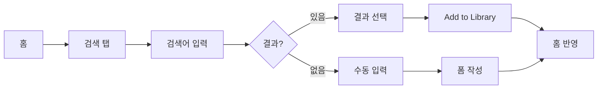
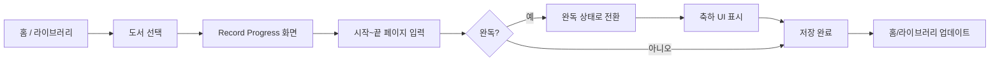
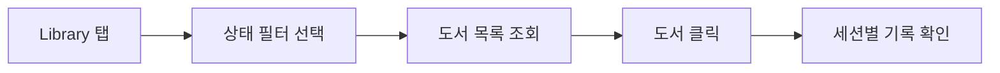
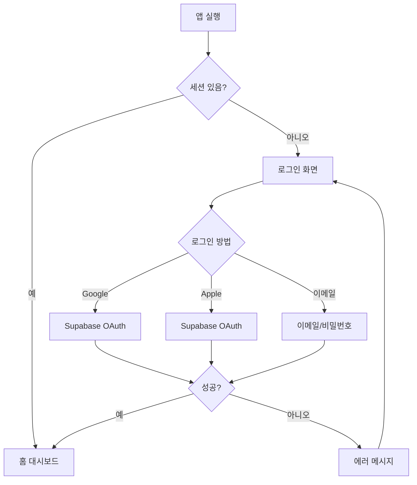
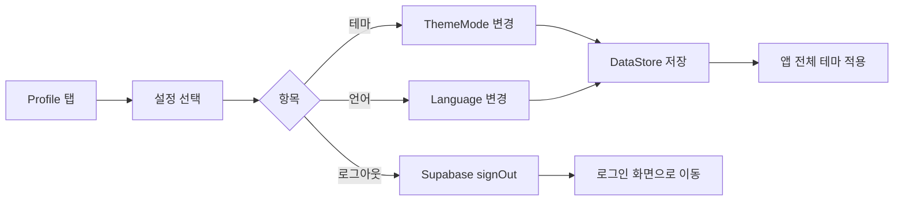

# 유저 플로우

## 플로우 1: 새 도서 추가 (검색)

---

## 플로우 2: 독서 진행 기록

---

## 플로우 3: 독서 히스토리 확인

---

## 플로우 4: 인증 흐름

---

## 플로우 5: 설정 변경

---

## 화면 전환 맵

| 출발 | 목적지 | 트리거 |
|---|---|---|
| Splash | Login | 세션 없음 |
| Splash | Home | 세션 있음 |
| Login | Home | 로그인 성공 |
| Home | Record Progress | "계속 읽기" 클릭 |
| Library | Record Progress | 도서 클릭 |
| Search | Manual Entry | "수동으로 입력하기" 클릭 |
| Search | Library | 도서 추가 성공 |
| Profile | Login | 로그아웃 |
